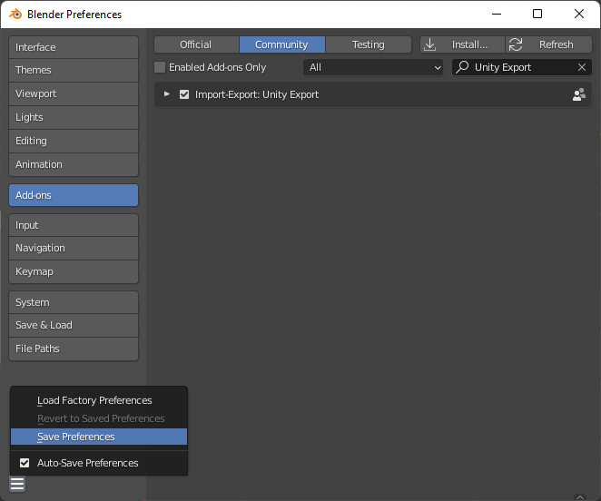
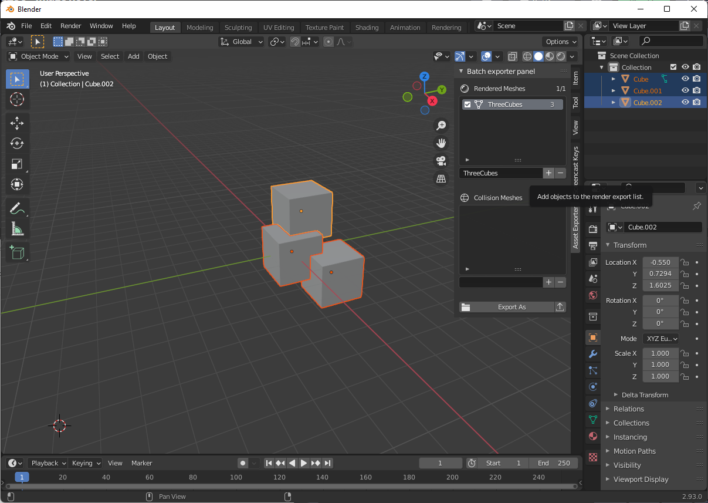

# BlenderAssetExportPanel
An asset export panel for blender.

Created out of necessity, originally made for quickly exporting groups of assets into Unity quickly, although it's not limitted to that application.

## How to install

1. Clone the repository or download the [`export_panel.py`](https://raw.githubusercontent.com/TUTAMKHAMON/BlenderAssetExportPanel/main/export_panel.py) file;
2. Go to Add-ons in Blender (`Edit > Preferences > Add-ons`) and click in the `Install...` button on the top right corner;
3. Browse to the file you downloaded and click `Install Add-on`;
4. The newly installed add-on should now appear on the list. Enable it;
5. Don't forget to manually save your preferences if you have `Auto-Save` disabled.

## How to use

The panel is very simple to use:

1. Simply open the sidebar panel by pressing `n`;
2. Open the `Asset Exporter` tab;
3. Select the objects you want to export into a file;
4. Write their name in the respective list (this will be used for the name of the file);
5. Click the add button;

When you are ready to export:
1. Just tick the boxes of the groups you want to export;
2. Press the `Export As` button;
3. Select the location and press `Select save location`.

This will export the files and save the save location for next time, where you can simply use the small `Quick Export` button next to the `Export As` button.
This should speed up the process of repeated exporting and updating assets.

##### Tips:
* If you are using Unity, selecting the folder in the project where you will use the assets (e.g. `Assets/Objects`), will make it so that a press of the `Quick Export` button works as way to quickly send your changes to Unity. This can save you a lot of time while iterating through asset changes.

To change the name of a group, simply double-click the name in the list and write the new name.

Each entry on the list shows a number at the end of it. This number represents the number of objects in the group. Pressing a number will select the objects of the corresponding group.

To remove entries, select them and press the `-` button.

## Types of export

The Asset Export panel shows 2 separate export lists, titled `Rendered Meshes` and `Collision Meshes`. Each list has different export settings:

###### Rendered Meshes:

Exports as an FBX as to include materials.
File is prefixed with `RDR-`;

###### Collision Meshes:

Exports as an OBJ without materials to be as light as possible.
File is prefixed with `COL-`;

## Known issues

* Deleting an object belonging to entry will not update it and will throw an error when trying to export it or trying to select its objects.

## Future work

These are the some of the things I would like to improve once I have the time:

* Ability to tweak export settings for each list;
* Ability to change the file prefixes for each list;
* Create export profiles for common applications (Unity, Unreal, Godot, ...);
* Ability to update existing entries;
* Check for repeated names;
* Ability to create an arbitrary amount of lists, each with their own export settings.

## Contributions

Any form of contribution is welcomed, be it through issue submissions or pull-requests.